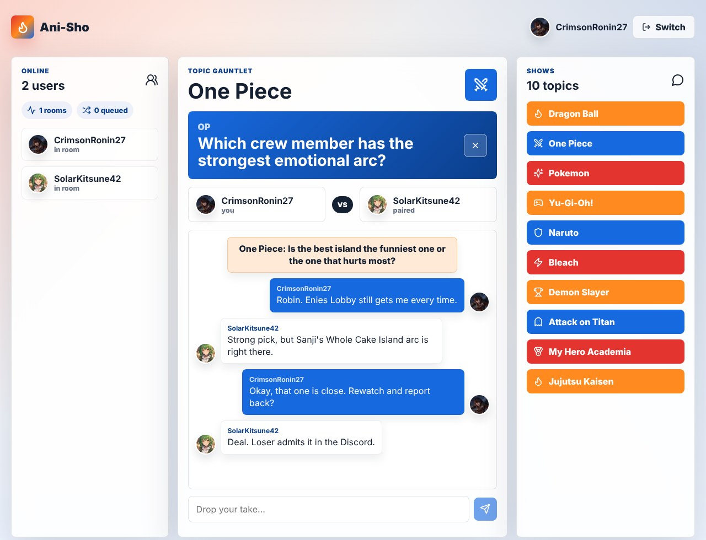
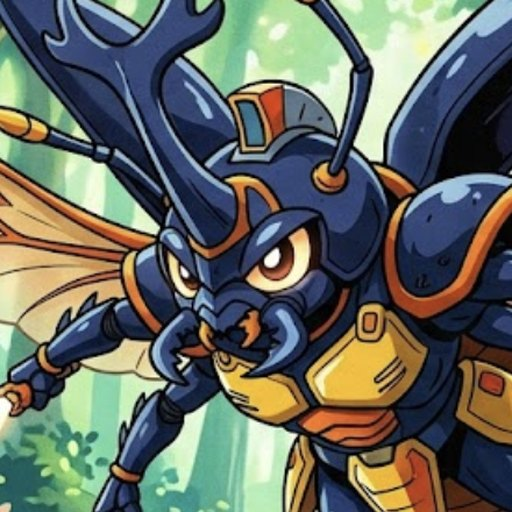
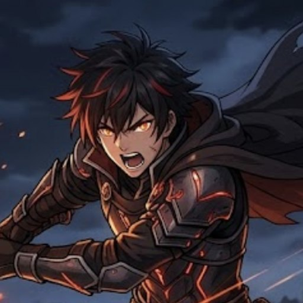
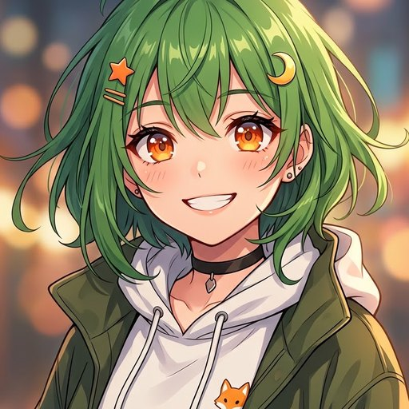
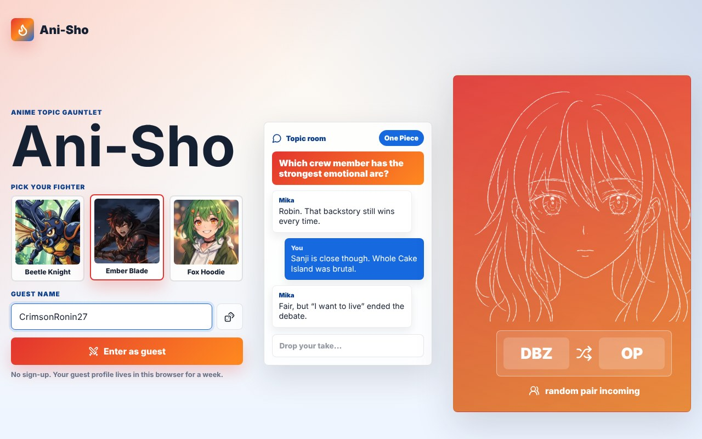

<div align="center">

# Ani-Sho

**A free, safe, account-free space to talk anime.**

Pick an avatar, get paired with a random fan, and debate.

[](https://discord.com/invite/9ACKupxDR2)
[](LICENSE)
[](#contributing)
[](#the-goal)



</div>

## The goal

Ani-Sho exists to be a **free, safe space for people to discuss anime**.

The big goal is to build this whole ecosystem **account free**. No sign-up, no email, no password, no "continue with Google". You pick a picture, get a name, and you are in. Users should never have to create an account, and that is a rule for every feature we add.

### What gets approved

Features are approved when they help that goal. A pull request has a strong chance if it:

- Makes anime discussion more fun, friendly, or welcoming
- Keeps people safe (moderation, reporting, blocking, anti-spam)
- Works without an account and without collecting personal data
- Stays free for everyone
- Still runs from a fresh clone with no API keys

A pull request will be declined if it adds sign-up, logins, paywalls, ads, or tracking.

## Join the Discord

Questions, ideas, bug reports, or just want to argue about power scaling?

**[Join us on Discord](https://discord.com/invite/9ACKupxDR2)**

It is the fastest way to ask how something works or pitch a feature before you build it.

## Attention artists

<p>
  
  
  
</p>

We would love for anime artists to create **original works for user profile pics**. Every guest picks one to represent them while they talk, so your art is the face of the community.

How to submit:

1. Make a square image, 512 x 512 or larger (JPG or PNG).
2. It must be your own original character. No existing anime characters and no traced or copied work.
3. Share it in the [Discord](https://discord.com/invite/9ACKupxDR2), or open a pull request that adds the file to `public/avatars` and one line to `src/lib/avatars.ts`.
4. Tell us the name you want credited.

By submitting, you confirm the work is yours and that it can be used in this project under the repo's license. Accepted artists are credited here.

## Ideas on the table

- **Crown the best debater.** A contest where the community picks the strongest debater.
- **More artist-made avatars.** See above.
- **Safety tools.** Reporting, blocking, and rate limits for guests.
- **More topics.** New shows and better prompts.
- **Shared room storage,** so matches work reliably on serverless hosting.

Want to take one on? Say so in the Discord first so two people are not building the same thing.

## Quick start

Requires Node.js 20 or newer. No environment variables and no API keys.

```bash
git clone https://github.com/maxiujin/anibate.git
cd anibate
npm install
npm run dev
```

Open http://localhost:3000.

To try a full match on one machine, open the site in two different browsers (or one normal window and one private window), enter as a guest in each, and press **Enter gauntlet** in both.

<div align="center">

</div>

## How it works

- **Guests, not accounts.** Entering creates a random token stored in an httpOnly cookie along with your chosen name and avatar. It lasts a week, or until you press **Switch**. See `src/lib/guest.ts`.
- **Avatars.** The built-in profile pictures live in `public/avatars` and are listed in `src/lib/avatars.ts`.
- **Matchmaking and chat.** The queue, rooms, and messages are held in server memory (`src/lib/forum-store.ts`). The browser polls `/api/gauntlet` every 2.5 seconds.
- **Topics.** The ten debate topics are in `src/lib/topics.ts`.

## Project layout

```
src/app/page.tsx              landing page and gauntlet shell
src/app/api/guest/route.ts    start or end a guest session
src/app/api/gauntlet/route.ts join, leave, send message, poll state
src/components/               guest picker, header chip, gauntlet UI
src/lib/                      guest session, avatars, topics, in-memory store
public/avatars/               avatar images
```

## Scripts

```bash
npm run dev     # local dev server
npm run build   # production build
npm run start   # serve the production build
npm run lint    # eslint
```

## Contributing

1. Fork the repo and create a branch.
2. Make your change and run `npm run lint` and `npm run build`.
3. Open a pull request against `main` and say how it helps [the goal](#the-goal).

Merged pull requests are deployed to the live site automatically.

Good first changes: add a topic in `src/lib/topics.ts`, or add an avatar (drop a square image in `public/avatars` and add one line to `src/lib/avatars.ts`).

Never commit secrets. The app needs none; see `.env.example`.

## Known limitations

- State is in memory, so rooms and chats reset when the server restarts.
- On serverless hosts, separate server instances do not share memory, so two players can occasionally land on different instances and not see each other. A shared store would fix this and is a welcome contribution, as long as local development keeps working with no keys.
- Guest sessions have no moderation or rate limiting yet.

## License

[MIT](LICENSE). Created and maintained by [@maxiujin](https://github.com/maxiujin).
